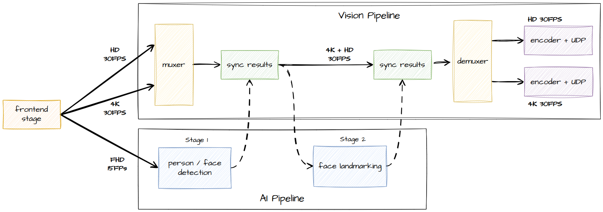

===============================
Hailo15 C++ Example Application
===============================

Overview
========

This application serves as reference code for developers who wish to build an end-to-end application on Hailo15 that integrates Hailo's AI inference capabilities and other hardware accelerated features. 
The application demonstrates how to assemple a native C++ pipeline with the following features:

- Integration with Media Library vision Frontend
- Integration with hardware acclerated encoders (H264, H265)
- Image cropping and resizing (tiling) using hardware accelerated DSP
- Inference using Hailort Async API
- Image overlay (OSD) using hardware accelerated DSP
- DMA buffer utilization
- Streaming to a remote server using RTSP

The reference shows how a user can integrate such features in a multi-threaded pipeline that maintains zero-copy behavior for high performance.

Running the Application
=======================

The applicaton will come pre-compiled and ready to run on the Hailo15 platform as part of the release image.

To run the ai_example_app application, follow these steps:

1. On the host machine, run a gstreamer streaming pipeline to capture video feed from the ethernet cable.
        Enter the following command in the terminal of the host machine:
    
        .. code-block:: bash
    
            $ gst-launch-1.0 udpsrc port=5000 address=10.0.0.2 ! application/x-rtp,encoding-name=H264 ! 
            queue max-size-buffers=30 max-size-bytes=0 max-size-time=0 leaky=no ! rtpjitterbuffer mode=0 ! 
            queue max-size-buffers=30 max-size-bytes=0 max-size-time=0 leaky=no ! rtph264depay ! 
            queue max-size-buffers=30 max-size-bytes=0 max-size-time=0 leaky=no ! h264parse ! avdec_h264 ! 
            queue max-size-buffers=30 max-size-bytes=0 max-size-time=0 leaky=downstream ! videoconvert n-threads=8 ! 
            queue max-size-buffers=30 max-size-bytes=0 max-size-time=0 leaky=no ! fpsdisplaysink text-overlay=false sync=false
    
        This will start the streaming pipeline and you will be able to see the video feed on the screen after starting the application in the next step.

2. On the Hailo15 platform, run the executable located at the following path:

    .. code-block:: bash

        $ ./apps/ai_example_app/ai_example_app

You should now be able to see the video feed with the inference overlay on the screen.

Extra Options
-------------

Some extra flags are available to run the application with different configurations:

    .. code-block:: bash

        $ ./apps/ai_example_app/ai_example_app --help
            Usage:
            AI pipeline app [OPTION...]

            -h, --help                  Show this help
            -t, --timeout arg           Time to run (default: 60)
            -p, --print-fps             Print FPS
            -l, --print-latency         Print Latency
            -c, --config-file-path arg  media library Configuration Path (default: 
                                        /etc/imaging/cfg/medialib_configs/ai_example_medialib_config.json)
            -a, --profile               Profile name (default: "Daylight")
            -d, --draw-overlay          Comma-separated list of stream numbers to draw overlay on (e.g., '0,1...'), will ignore any non-existing streams (default "1")
            -f, --full-landmarks        Draw all landmarks (default draws only eyes for face landmarks)
            -o, --host-ip               Host IP address for UDP output (default: "10.0.0.2")

Some of the flags control basic pipeline functionality (timeout / print-fps), in particular the **--skip-drawing** 
and **--full-landmarks** flags can be used to control the drawing behavior of the pipeline. Drawing bounding boxes and face landmarks
can be compute heavy at large quantities and may impact performance. The **--skip-drawing** flag will disable all drawing, 
while the **--full-landmarks** flag will draw to full set of landmarks. For running the application
on large crowds, it is recommended to leave the default flag or skip drawing entirely.

Note that you have the option to change the configuration file path for the vision pipeline configurations: **--config-file-path**. 
Within this configuration file are multiple options for vision profiles to choose from, such as high-dynamic-range (HDR) and low-light enhancement (denoising).
To choose a specific profile, you can use the **--profile** flag.

    .. note:: 
        Each profile chosen comes with it's own configuration tree for the vision pipeline, which includes settings for the 3AConfig (Auto Exposure, Auto White Balance, etc..) and other parameters.

As you experiment with the application you may want to create your own profile configurations and test them out, you may do so by setting your configuration file with the **--config-file-path** flag.

Application at a Glance
=======================

Now that you are able to run the application, let's discuss what you are seeing.
Below you can see the pipeline that the application is running:

This is a simplified view of the full pipeline, but we will break it down into smaller peices later. For now the key takeways are:

- The pipeline outputs 2 vision streams: one of just video (4K), and a second (HD) with the inference overlay.
- The AI pipeline is comprised of two stages:
    - The first stage performs yolo object detection (person and face classes) on a tiled FHD stream
        - Netwrork: yolov8n_personface
        - Input: 640x384 NV12
        - Classes: Person, Face
        - Output: FLOAT32, HAILO NMS(number of classes: 2, maximum bounding boxes per class: 80, maximum frame size: 3208)
    - The second stage performs facial landmarking on faces detected in the first stage
        - Netwrork: MediaPipe face landmarks
        - Input: 192x192 NV12
        - Output: UINT8, NC(62)
- In both stages of the AI pipeline the DSP is used to crop and resize the image before inference is performed

Seeing the Other Streams
========================

In `Running the Application`_, we saw how to see the inference overlay stream. 
If you want to see the other streams (HD & SD), you simply need to open more streaming pipelines on the host machine.

Each stream is output on a different port, so you will need to open a new pipeline for each stream you want to see.
Note that in the streaming pipeline shown before targets a specific port (port=5000). 
To target another port, you will need to change the port number in the pipeline and run it separately.
The application outputs streams to the following port numbers:

- HD Stream: 5002
- 4K Stream: 5000

For example, to display the HD stream run the following ajusted pipeline on the host machine:
    
        .. code-block:: bash
    
            $ gst-launch-1.0 udpsrc port=5002 address=10.0.0.2 ! application/x-rtp,encoding-name=H264 ! 
            queue max-size-buffers=30 max-size-bytes=0 max-size-time=0 leaky=no ! rtpjitterbuffer mode=0 ! 
            queue max-size-buffers=30 max-size-bytes=0 max-size-time=0 leaky=no ! rtph264depay ! 
            queue max-size-buffers=30 max-size-bytes=0 max-size-time=0 leaky=no ! h264parse ! avdec_h264 ! 
            queue max-size-buffers=30 max-size-bytes=0 max-size-time=0 leaky=downstream ! videoconvert n-threads=8 ! 
            queue max-size-buffers=30 max-size-bytes=0 max-size-time=0 leaky=no ! fpsdisplaysink text-overlay=false sync=false

Where to go from here
=====================

Further documentation is available in the following sections:

- `Understanding the Pipeline <docs/pipeline.rst>`_: Further details on the reference pipeline presented with focus on the AI stream.
- `Compiling and Deploying <docs/compiling.rst>`_: The application is pre-compiled and ready to run on the Hailo15 platform. If you want to make changes to the application, you will need to compile it yourself.
- `Application Structure <docs/app_structure.rst>`_: An in depth look at the technical design of how the application is implemented. Here design decisions are explained.
