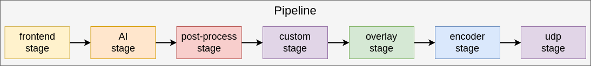

=======================
Custom Stage Case Study
=======================

Overview
========
After you have seen a few example pipelines, you may want to start building your own. If you choose to build a pipeline using
the provided Reference Camera API, you may find that the provided stages do not meet your needs. 
In this case, you can create your own custom stage. 

This example shows how to create a very basic custom stage that simply accesses detection results from the AI stage and prints them to the console.
The key takeaway from this example is how to create a custom stage that can be used in a pipeline.

Running the Application
=======================

The applicaton will come pre-compiled and ready to run on the Hailo15 platform as part of the release image.

To run the detection application, follow these steps:

1. On the host machine, run a gstreamer streaming pipeline to capture video feed from the ethernet cable.
        Enter the following command in the terminal of the host machine:
    
        .. code-block:: bash
    
            $ gst-launch-1.0 udpsrc port=5000 address=10.0.0.2 ! application/x-rtp,encoding-name=H264 ! 
            queue max-size-buffers=30 max-size-bytes=0 max-size-time=0 leaky=no ! rtpjitterbuffer mode=0 ! 
            queue max-size-buffers=30 max-size-bytes=0 max-size-time=0 leaky=no ! rtph264depay ! 
            queue max-size-buffers=30 max-size-bytes=0 max-size-time=0 leaky=no ! h264parse ! avdec_h264 ! 
            queue max-size-buffers=30 max-size-bytes=0 max-size-time=0 leaky=downstream ! videoconvert n-threads=8 ! 
            queue max-size-buffers=30 max-size-bytes=0 max-size-time=0 leaky=no ! fpsdisplaysink text-overlay=false sync=false
    
        This will start the streaming pipeline and you will be able to see the video feed on the screen after starting the application in the next step.

2. On the Hailo15 platform, run the executable located at the following path:

    .. code-block:: bash

        $ ./apps/case_studies/custom_stage/custom_stage_case_study

You should now be able to see the video feed with the inference overlay on the screen, while inference results print to the console.

Application at a Glance
=======================
You can see how the classes from the Reference Camera API are used to build the pipeline here:

This example expands on the `Detection Case Study <../detection/README.rst>`_, and only adds the one custome stage.
The stage is placed after the post-process stage so that we have human readable results to print to the console.

Lets look at the different stages used in this pipeline in the order they operate:

1. **Frontend Stage**: The frontend stage is used to access the video feed from the Media Library. It is responsible for capturing frames from the camera and passing them to the next stage in the pipeline.

    .. image:: ../readme_resources/frontend_stage.png
        :alt: frontend stage
        :align: center

    Hardware components involved: **ISP**, **DSP**

2. **AI Pipeline**: Like in the detection case study, we have a very basic AI pipeline that runs a single model on the video frames.
   Remember that inference is accelerated on the NN-Core, then tensor outputs are post-processed on the CPU.

    .. image:: readme_resources/ai_pipeline_basic.png
        :alt: frontend stage
        :align: center

    Hardware components involved: **NN-Core**, **CPU**

3. **Custom Stage**: The custom stage is a user-defined stage that can be used to perform any custom processing on the video frames or inference results. In this example, the custom stage simply prints the detection results to the console.
   When writing your own stage, it is important to take advantage of any hardware acceleration available on the Hailo-15 platform.
   While this example only shows how to quickly build a stage that accesses inference results, future case studies will incrementally 
   show more advanced use cases including bufferpools, DSP operations, and more.

    .. image:: ../readme_resources/custom_stage.png
        :alt: frontend stage
        :align: center

    Hardware components involved: **CPU**

4. **Results Pipeline**: This section of the application should start to look very familiar, we draw inference results on the video frame in the CPU, and then encode the stream using the hardware accelerated encoder. Lastly the stream is sent over the network using UDP.

    .. image:: readme_resources/results_pipeline.png
        :alt: frontend stage
        :align: center

    Hardware components involved: **CPU**, **Encoder**

You have now had a first taste of how to build your own custom stage. See further case studies to learn how to build more advanced stages!