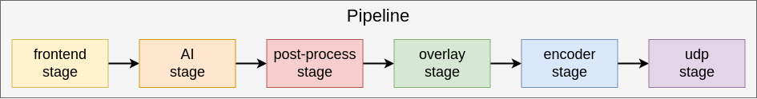

====================
Detection Case Study
====================

Overview
========
This example shows a simple detection pipeline.
The key takeaway from this example is how to run basic inference on a single stream using the Hailo-15 hardware accelerated NN-core.
This app specifically shows how to 

Running the Application
=======================

The applicaton will come pre-compiled and ready to run on the Hailo15 platform as part of the release image.

To run the detection application, follow these steps:

1. On the host machine, run a gstreamer streaming pipeline to capture video feed from the ethernet cable.
        Enter the following command in the terminal of the host machine:
    
        .. code-block:: bash
    
            $ gst-launch-1.0 udpsrc port=5000 address=10.0.0.2 ! application/x-rtp,encoding-name=H264 ! 
            queue max-size-buffers=30 max-size-bytes=0 max-size-time=0 leaky=no ! rtpjitterbuffer mode=0 ! 
            queue max-size-buffers=30 max-size-bytes=0 max-size-time=0 leaky=no ! rtph264depay ! 
            queue max-size-buffers=30 max-size-bytes=0 max-size-time=0 leaky=no ! h264parse ! avdec_h264 ! 
            queue max-size-buffers=30 max-size-bytes=0 max-size-time=0 leaky=downstream ! videoconvert n-threads=8 ! 
            queue max-size-buffers=30 max-size-bytes=0 max-size-time=0 leaky=no ! fpsdisplaysink text-overlay=false sync=false
    
        This will start the streaming pipeline and you will be able to see the video feed on the screen after starting the application in the next step.

2. On the Hailo15 platform, run the executable located at the following path:

    .. code-block:: bash

        $ ./apps/case_studies/detection/detection_case_study

You should now be able to see the video feed with the inference overlay on the screen.

Application at a Glance
=======================
You can see how the classes from the Reference Camera API are used to build the pipeline here:

At first it may look like there are a lot of new stages compared to the `Single Stream Case Study <../single_stream/README.rst>`_, but each only has one simple focus to grasp.

Lets look at the different stages used in this pipeline in the order they operate:

1. **Frontend Stage**: The frontend stage is used to access the video feed from the Media Library. It is responsible for capturing frames from the camera and passing them to the next stage in the pipeline.

    .. image:: ../readme_resources/frontend_stage.png
        :alt: frontend stage
        :align: center

    Hardware components involved: **ISP**, **DSP**

2. **AI Stage**: The AI stage is used to perform inference on the video frames captured by the frontend stage. It uses the Hailo-15 hardware accelerated NN-core to run the inference model and generate detection results. AI results are called **tensors**, and are attached to their corresponding video frame as metadata.

    .. image:: ../readme_resources/ai_stage.png
        :alt: frontend stage
        :align: center

    Hardware components involved: **NN-Core**

3. **Post-Process Stage**: The post-process stage is used to process the inference results generated by the AI stage. It is responsible for turning the raw output tensors into a human-readable format, such as bounding boxes and labels for detected objects.
   Post-processing is typically done on the CPU.

    .. image:: ../readme_resources/postprocess_stage.png
        :alt: frontend stage
        :align: center

    Hardware components involved: **CPU**

4. **Overlay Stage**: The overlay stage is used to overlay the processed inference results on the video frames. It takes the processed results from the post-process stage and draws them on the video frames, allowing users to see the detected objects in-picture.
   This is typically done for demo purposes, and is not required for the pipeline to function.

    .. image:: ../readme_resources/overlay_stage.png
        :alt: frontend stage
        :align: center

    Hardware components involved: **CPU**

5. **Encoder Stage**: The encoder stage is used to encode raw video feed into an encoded format (H264/H265). Encoding allows the video to be streamed over the network efficiently - higher-quality transmission can be transmitted at lower bandwidth because the bytes required are compressed.
   
    .. image:: ../readme_resources/encoder_stage.png
        :alt: encoder stage
        :align: center

    Hardware components involved: **Encoder**

6. **UDP Stage**: The last stage in this pipeline is the UDP stage. This stage is responsible for sending the encoded video stream over the network using the UDP protocol.
   The UDP stage takes the encoded video frames from the encoder stage and sends them to a specified IP address and port.

    .. image:: ../readme_resources/udp_stage.png
        :alt: udp stage
        :align: center

Putting it all together, we have a pipeline that takes video feed from the sensor, runs inference on it, and streams the results over the network.
The AI + Post-Process stages together are commonly referred to as the **AI Pipeline**. 