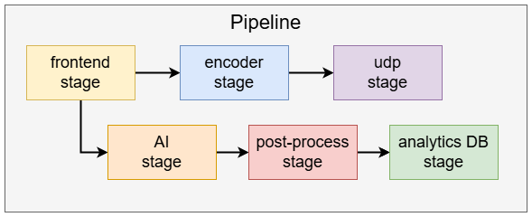

===============================
Dynamic Privacy Mask Case Study
===============================

Overview
========
This example demonstrates a vision pipeline for dynamic privacy masking using AI-based segmentation. The key takeaway from this example is how to use the Media Library to access a video feed, apply AI-based segmentation to identify regions of interest, and dynamically mask sensitive areas in the video stream before encoding and streaming.

Running the Application
=======================

The application comes pre-compiled and ready to run on the Hailo15 platform as part of the release image.

To run the dynamic_privacy_mask application, follow these steps:

1. On the host machine, run a gstreamer streaming pipeline to capture video feed from the ethernet cable.
        Enter the following command in the terminal of the host machine:
    
        .. code-block:: bash
    
            $ gst-launch-1.0 udpsrc port=5000 address=10.0.0.2 ! application/x-rtp,encoding-name=H264 ! queue max-size-buffers=30 max-size-bytes=0 max-size-time=0 leaky=no ! rtpjitterbuffer mode=0 ! queue max-size-buffers=30 max-size-bytes=0 max-size-time=0 leaky=no ! rtph264depay ! queue max-size-buffers=30 max-size-bytes=0 max-size-time=0 leaky=no ! h264parse ! avdec_h264 ! queue max-size-buffers=30 max-size-bytes=0 max-size-time=0 leaky=downstream ! videoconvert n-threads=8 ! queue max-size-buffers=30 max-size-bytes=0 max-size-time=0 leaky=no ! fpsdisplaysink text-overlay=false sync=false
    
        This will start the streaming pipeline and you will be able to see the video feed on the screen after starting the application in the next step.

2. On the Hailo15 platform, run the executable located at the following path:

    .. code-block:: bash

        $ ./apps/case_studies/dynamic_privacy_mask/dynamic_privacy_mask_case_study

You should now be able to see the video feed with sensitive areas dynamically masked based on AI inference.

Application at a Glance
=======================
How is this application built? The pipeline leverages the Reference Camera API to construct a vision pipeline with dynamic privacy masking:

The pipeline consists of discrete components called stages, where each stage performs a specific task—such as AI-based segmentation, analytics database integration, encoding, or streaming. Each stage runs in its own thread, enabling efficient parallel processing and modularity.

To manage the stages, we create a **Pipeline** instance. This class manages the enclosed stages and allows the user to *start* and *stop* streaming.

Stages in the Pipeline
======================

1. **Frontend Stage**: Captures video feed from the Media Library and performs basic image adjustments such as **dewarping** and **resizing** using the **DSP** for hardware acceleration.

    .. image:: ../readme_resources/frontend_stage.png
        :alt: Frontend Stage
        :align: center

    Hardware components involved: **ISP**, **DSP**

2. **AI Stage**: The AI stage is used to perform inference on the video frames captured by the frontend stage. It uses the Hailo-15 hardware accelerated NN-core to run the inference model and generate segmentation results. AI results are called **tensors**, and are attached to their corresponding video frame as metadata.

    .. image:: ../readme_resources/ai_stage.png
        :alt: frontend stage
        :align: center

    Hardware components involved: **NN-Core**

3. **Post-Process Stage**: The post-process stage is used to process the inference results generated by the AI stage. It is responsible for turning the raw output tensors into a human-readable format, such as bounding boxes and labels for detected objects.
   Post-processing is typically done on the CPU.

    .. image:: ../readme_resources/postprocess_stage.png
        :alt: frontend stage
        :align: center

    Hardware components involved: **CPU**

4. **Analytics Database Stage**: Sends the segmentation results (privacy masks) to an analytics database. The encoder retrieves these masks from the database and applies them to the video stream during encoding.

    .. image:: ../readme_resources/analytics_db_stage.png
        :alt: Analytics Database Stage
        :align: center

5. **Encoder Stage**: Encodes the masked video feed into an efficient format (H264/H265) for streaming. The Hailo15 hardware encoder ensures real-time encoding with minimal CPU overhead.

    .. image:: ../readme_resources/encoder_stage.png
        :alt: Encoder Stage
        :align: center

    Hardware components involved:  **Encoder**, **DSP**

6. **UDP Stage**: Streams the encoded video over the network using the UDP protocol.

    .. image:: ../readme_resources/udp_stage.png
        :alt: UDP Stage
        :align: center

Putting it all together, the pipeline facilitates real-time dynamic privacy masking and streaming from the camera to the host machine.