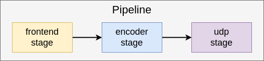

========================
Single Stream Case Study
========================

Overview
========
This example shows a simple single stream vision pipeline.
The key takeaway from this example is how to access a video feed from the Media Library and encode that video
using an encoder for streaming.

Running the Application
=======================

The applicaton will come pre-compiled and ready to run on the Hailo15 platform as part of the release image.

To run the single_stream application, follow these steps:

1. On the host machine, run a gstreamer streaming pipeline to capture video feed from the ethernet cable.
        Enter the following command in the terminal of the host machine:
    
        .. code-block:: bash
    
            $ gst-launch-1.0 udpsrc port=5000 address=10.0.0.2 ! application/x-rtp,encoding-name=H264 ! 
            queue max-size-buffers=30 max-size-bytes=0 max-size-time=0 leaky=no ! rtpjitterbuffer mode=0 ! 
            queue max-size-buffers=30 max-size-bytes=0 max-size-time=0 leaky=no ! rtph264depay ! 
            queue max-size-buffers=30 max-size-bytes=0 max-size-time=0 leaky=no ! h264parse ! avdec_h264 ! 
            queue max-size-buffers=30 max-size-bytes=0 max-size-time=0 leaky=downstream ! videoconvert n-threads=8 ! 
            queue max-size-buffers=30 max-size-bytes=0 max-size-time=0 leaky=no ! fpsdisplaysink text-overlay=false sync=false
    
        This will start the streaming pipeline and you will be able to see the video feed on the screen after starting the application in the next step.

2. On the Hailo15 platform, run the executable located at the following path:

    .. code-block:: bash

        $ ./apps/case_studies/single_stream/single_stream_case_study

You should now be able to see the video feed with the inference overlay on the screen.

Application at a Glance
=======================
So how is this application actually built? You can see how the classes from the Reference Camera API are used to build the pipeline here:

We build a media pipeline using discrete components called stages, where each stage performs a specific task—such as encoding or adding overlays. 
Each stage runs in its own thread, allowing the pipeline to process data efficiently in parallel, stay responsive under load, and remain modular and easy to extend.

As you can see, you can build a streaming pipeline using minimal components.
To house and manage the different stages used, we create a **Pipeline** instance. This class manages the enclosed stages and allows
the user to *start* and *stop* streaming.

.. image:: ../readme_resources/pipeline_class.png
    :alt: pipeline class
    :align: center

Lets look at the different stages used in this pipeline in the order they operate:

1. **Frontend Stage**: The frontend stage is used to access the video feed from the Media Library. It is responsible for capturing frames from the camera and passing them to the next stage in the pipeline.
   
   Besides capturing frames, the Frontend also performs some basic image adjustment, such as **dewarping** and **resizing**. these operations are performed on the **DSP** for hardware acceleration.

    .. image:: ../readme_resources/frontend_stage.png
        :alt: frontend stage
        :align: center

    Hardware components involved: **ISP**, **DSP**

2. **Encoder Stage**: The encoder stage is used to encode raw video feed into an encoded format (H264/H265). Encoding allows the video to be streamed over the network efficiently - higher-quality transmission can be transmitted at lower bandwidth because the bytes required are compressed.
   
    .. image:: ../readme_resources/encoder_stage.png
        :alt: encoder stage
        :align: center

    Hardware components involved: **Encoder**
   
   It is important to note that the Hailo-15 comes with an on-chip hardware encoder, which allows for real-time encoding of video streams.
   This also reduces the workload required for compression form the CPU, allowing for a more efficient use of resources.
   
   The Hailo Media Library provides a C++ interface to access the hardware encoder. The Reference Camera API further 
   provides the **EncoderStage** class, which wraps this interface so that it may be easily used in a pipeline.

3. **UDP Stage**: The last stage in this pipeline is the UDP stage. This stage is responsible for sending the encoded video stream over the network using the UDP protocol.
   The UDP stage takes the encoded video frames from the encoder stage and sends them to a specified IP address and port.

    .. image:: ../readme_resources/udp_stage.png
        :alt: udp stage
        :align: center

Putting it all together, we now have what is commonly referred to as a **"Vision Pipeline"**: it facilitates streaming from the camera to the host machine. 