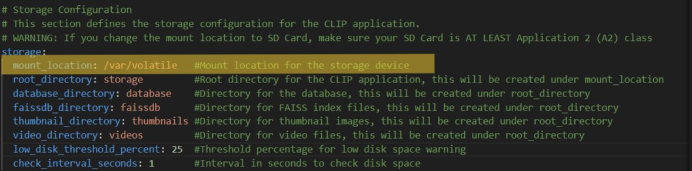
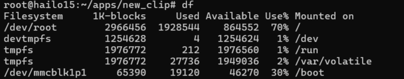

========================================================================
Free Text Search App (CLIP) Installation and Usage Instructions
========================================================================

.. contents:: Table of Contents
   :depth: 2
   :local:

Installation Instruction
=========================

Prerequisite
============

* By default, Clip App works best on Hailo-15H (Rev 2.10) with 4GB of memory as Clip data is saved to memory by default

  * The storage path can be changed to use an SD card; however, ensure that an A2-class SD card is used. For more details, refer to the App Configuration section below.

* For Hailo-15H 2GB and Hailo-15L 2GB platforms, the following requirements apply:

  * Use eMMC Only. This is mandatory to avoid unexpected issues
  * Change the storage mount point to eMMC, please see App Configuration section below on how to change mount point.
  * Reduce the Hailo Media Library (HML) CMA buffer by 128MB to free up memory in the user domain for the Clip application. For instructions please consult with Hailo support team.

Usage Instruction
=================

How to launch the App
---------------------

1. Navigate to ``/home/root/apps/new_clip`` and execute ``./new_clip_app``.
2. On the host system (PC or laptop), launch Chrome or Edge and navigate to the specified URL ``http://10.0.0.1/``

.. note::
   This application streams encoded high-resolution video. On Hailo-15H SBC/EVB platforms, a 4K camera sensor may be included. Ensure the host PC or laptop is capable of decoding 4K H.264 video, as both live streaming and event-triggered video playback are 4K encoded.

How to use the App
------------------

Clip Network
~~~~~~~~~~~~

Before using the prompt to perform a search query, ensure that the network is selected first. Although multiple networks can be supported in parallel, the official release defaults to Clip ViT 32B.

Prompts
~~~~~~~

1. **Positive** - Defines the event to search for. It is recommended to start with "a photo of a person" followed by the event. For example "a photo of a person drinking a bottle of water"

2. **Negative** - Helps exclude unwanted results. By default, one negative prompt is included: "a photo of a person". This should remain, but additional negatives can be added as needed. In general, the default negative prompt works well, so focus primarily on refining the positive prompt.

Query
~~~~~

Click the Query button to start the search. The results will appear on the left in the Query Gallery.

Query Adjustment
~~~~~~~~~~~~~~~~

It will be necessary to select Query again, If any of the settings below have been adjusted.

1. **Score Threshold** - Represents the probability level. The default value is 0.9 (90%). Adjust this threshold as needed to achieve a balance between accurate results and filtering out false positives.

2. **Max Query** - Shows the maximum top score query, default is 20 which is more than enough for demo/show event.

3. **Remove Duplicate Within Sec** - Filters out repeated occurrences of the same event within the specified time window (default: 60 seconds). For example: If the same person remains in front of the camera smoking for 120 seconds and this value is set to 1 second, the system may return over 100 identical event results (limited by the maximum query setting, e.g., 20 results). With the default value of 60 seconds, only two identical events would be returned for the same scenario.

Other Settings
~~~~~~~~~~~~~~

A Settings icon is located on the left. Clicking it opens a panel with additional configuration options.

1. **Tracked Image Embedding Frame Refresh Rate** - The default value is 15 frames, meaning an embedding of the tracked image is saved to the database every 15 frames for event search purposes. Lower values capture more embeddings, which increases storage usage. Why adjust this setting? Lowering the number improves detection of short-duration events, while increasing it reduces storage consumption. Examples are provided below.

   a. **A person showing thumbs up case** - When searching for a person showing a thumbs-up gesture, the action may occur quickly (within a second). Capturing an embedding every 15 frames might not be sufficient. Reducing the interval to every 5 frames can improve detection of short-duration events. This value is approximate and not exact.

   b. **Smoking cigarette case** - Smoking typically lasts several minutes. In this scenario, capturing every 60 frames (approximately every 2 seconds) is generally sufficient to detect the event.

2. **Query Video Playback Total Length (Seconds)** - The default value is 15 seconds. When a thumbnail is selected from the query gallery, the video playback duration is determined by this setting. With the default configuration, approximately 7.5 seconds before the event and 7.5 seconds after the event are included. This is an approximate value, not an exact figure.

App Configuration
=================

Changing Storage Path
---------------------

The Clip app data storage location can be modified in ``clip_app_config.yaml``, located under the ``resources/configs`` directory. Navigate to the "Storage" section and update the mount_location parameter as shown in the image below.

By default, the mount location is set to ``/var/volatile``, which uses the system’s tmpfs (memory). This can be verified by running the ``df`` command on the H15 system.

If the Hailo-15 image is burnt on the SD card that is say 32GB of space it is likely that only around 3GB is being seen as being claimed for root filesystem. It is possible to claim the rest of the space by creating another partition, for instructions please see SD Card Partition section in this guide.

.. note::
   If one chooses to follow the SD Card partition guide by default it will create a partition and mount to ``/data``, therefore it is only needed to set ``mount_location`` to ``/data`` in this case.

SD Card Partition
=================

Please check `Storage Partition <docs/storage_partition.rst>`_ for detailed instructions on expanding SDCard available space.
